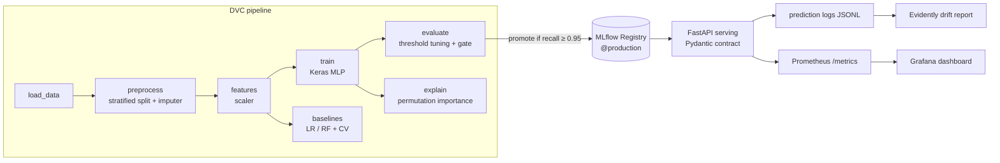

# Breast Cancer Classifier — End-to-End MLOps

[](https://github.com/FabioCLima/MLOPs_project_breast_cancer/actions/workflows/ci.yml)
[](pyproject.toml)

A binary classification system (malignant vs. benign tumors) built as a **complete MLOps case study**: reproducible pipeline, experiment tracking with a model registry and promotion gate, contract-validated serving, containerized infrastructure, and production monitoring with drift detection.

> ⚠️ Didactic project on a small public dataset. **Not for clinical use** — see [MODEL_CARD.md](MODEL_CARD.md).

## Architecture



Data contracts (Pandera) guard every pipeline boundary; the serving contract (Pydantic) is generated from the **same canonical feature list** — schema skew between training and serving is impossible by construction.

## Results

| Model | ROC-AUC (5-fold CV) | Malignant recall (test) | Notes |
|-------|--------------------:|------------------------:|-------|
| Logistic Regression | **0.994 ± 0.006** | **0.976** | baseline, interpretable, ms training |
| Random Forest | 0.988 ± 0.007 | 0.929 | |
| Keras MLP (served) | — (single split) | **0.976** | ROC-AUC 0.992, Brier 0.040 |

**The honest finding:** a logistic regression matches the neural network on this dataset (569 rows, 30 well-behaved tabular features) — the expected outcome, measured rather than assumed. The MLP is served to exercise the full TensorFlow → registry → API path; the comparison table is the evidence a real model choice would be based on.

**Clinical framing:** the decision threshold (0.88) is tuned on the validation set to maximize malignant recall under a precision constraint — a false negative (missed cancer) costs far more than a false positive (extra exam). At that operating point: recall 0.976, precision 0.837, accuracy 0.921. A model version is only promoted to `@production` if test recall ≥ 0.95 (executable gate — it has already caught one bad threshold during development).

## Quickstart

```bash
# Environment (Python 3.12 pinned — TF 2.19 has no 3.13 wheels)
uv sync --python 3.12

# Full pipeline: data → preprocess → features → train/baselines → evaluate → explain
uv run dvc repro

# Experiment tracking UI (runs, registry, promotion gate)
uv run mlflow ui --backend-store-uri sqlite:///mlflow.db   # http://localhost:5000

# Serving (loads model from registry @production, threshold from evaluation)
uv run uvicorn --factory app.api:create_app --port 5001    # http://localhost:5001/docs

# Quality gates (same as CI)
uv run ruff check . && uv run mypy src/ app/ && uv run pytest tests/ -q   # 32 tests

# Drift detection demo (shifts the top-3 important features; detects exactly those 3)
uv run python -m src.monitoring.drift_report --simulate
```

### Full stack (Docker Compose)

```bash
docker compose up --build
```

| Service | URL |
|---------|-----|
| API (Swagger) | http://localhost:5001/docs |
| MLflow | http://localhost:5000 |
| MinIO console | http://localhost:9101 (minioadmin/minioadmin) |
| Prometheus | http://localhost:9090 |
| Grafana (provisioned dashboard) | http://localhost:3000 (admin/admin) |

### Kubernetes (kind)

Deployment with liveness/readiness probes, Service and HPA: see [deploy/k8s/README.md](deploy/k8s/README.md).

## API

```bash
curl -X POST localhost:5001/predict -H 'Content-Type: application/json' \
  -d '{"records":[{"mean radius": 17.99, "mean texture": 10.38, ...}]}'
# → {"model_version":"v2","decision_threshold":0.88,
#    "results":[{"prediction":0,"label":"malignant","probability_benign":0.0}]}
```

`GET /health` · `GET /metadata` (version, threshold, metrics) · `POST /predict` · `POST /predict/batch` (CSV) · `GET /metrics` (Prometheus). Invalid input returns 422 naming the offending field. Every response carries the model version — full audit trail back to the MLflow run.

## Engineering highlights

- **Leakage-free by test, not by hope** — train/val/test split happens before any transformer is fitted; `tests/test_no_leakage.py` proves imputer/scaler statistics match train-only moments. (The original code had validation leakage via Keras `validation_split` — found, fixed, and regression-tested.)
- **Data contracts at every boundary** — Pandera schemas (raw/preprocessed/processed) in the pipeline, Pydantic at the API, both generated from one canonical feature list.
- **Promotion as code** — MLflow registry alias moves only if the clinical metric passes; rollback is a metadata operation.
- **Observability chain** — structured JSONL prediction logs (the raw material) → Prometheus proxies (malignant-rate, probability distribution) → Evidently per-feature K-S drift reports. Detection validated with synthetic drift: 3/3 shifted features flagged, 0 false positives.
- **CI/CD** — lint + types + tests on every push; CD retrains from scratch (`dvc repro`), builds the multi-stage non-root image, smoke-tests `/health` in a real container, then publishes to GHCR.

## Decisions — including what was deliberately NOT used

Architecture Decision Records in [docs/adr/](docs/adr/): [DVC over Airflow](docs/adr/0001-dvc-como-orquestrador.md) · [FastAPI over Flask](docs/adr/0002-fastapi-no-lugar-de-flask.md) · [MLflow, no W&B](docs/adr/0003-mlflow-nao-wandb.md) · [threshold as a versioned business parameter](docs/adr/0004-threshold-como-parametro-de-negocio.md) · [**no feature store**](docs/adr/0005-sem-feature-store.md) (this project has none of the three problems Feast solves — the ADR lists the criteria that would change the answer).

## Limitations & production considerations

Small single-center 1990s dataset; no external validation; univariate drift detection misses multivariate shifts; concept drift requires delayed labels. Full discussion — including privacy (LGPD), audit trail and bias — in [MODEL_CARD.md](MODEL_CARD.md) and [docs/diario/fase5-item25](docs/diario/fase5-item25-avaliacao-em-producao.md).

## Learning journal (pt-BR)

Every change in this repo is documented in [docs/diario/](docs/diario/README.md) — 18 entries pairing each implementation with the theory in Chip Huyen's *Designing Machine Learning Systems*, written for junior ML engineers to read book and code side by side. The phased plan lives in [ROADMAP.md](ROADMAP.md) / [BACKLOG.md](BACKLOG.md).

## Project structure

```
├── app/                  # FastAPI serving: api, schemas, model_service, metrics, prediction_logger
├── src/
│   ├── config/           # paths, params, features (canonical contract), tracking, logging
│   ├── data_*/           # pipeline stages (loading, preprocessing, validation)
│   ├── feature_engineering/, model_training/, model_evaluation/
│   └── monitoring/       # Evidently drift report
├── tests/                # 32 tests: leakage, schemas, units, API contract, observability
├── deploy/               # k8s manifests, prometheus/grafana provisioning
├── docs/                 # diário (learning journal), ADRs
├── dvc.yaml / params.yaml
├── docker-compose.yml / Dockerfile
└── MODEL_CARD.md
```
